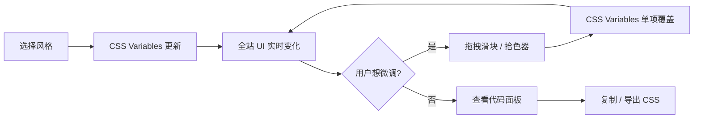

# 🎨 Web Style Visualisation

> 一个交互式的网站风格可视化工具 — 选择一种设计风格，**整个网站立即变身**，并提供细粒度微调控制。
>
> 🔗 部署于 GitHub Pages | 基于 Vite 构建

## 项目背景

许多设计师在工作中需要了解不同网站风格的特点，但缺乏直观的方式来感受各种设计风格的差异。本工具不是简单的代码展示 — 而是让用户**身临其境**：选择一种风格后，整个网站（导航栏、卡片、按钮、表单、排版…）都会实时切换到该风格，并可以通过微调面板精细调节颜色、圆角、阴影等参数。

## 目标用户

- 尚未接触过各类网站 style 的**初级/转型设计师**
- 希望快速了解不同风格代码实现的**前端学习者**
- 需要为客户展示风格方案的**设计咨询师**

---

## 核心交互模式

### � 核心理念：选风格 → 全站变 → 可微调

```
┌─────────────────────────────────────────────────────────────────┐
│  🎨 Web Style Visualisation            [Flat ▾] [Code] [About] │  ← 导航栏跟随风格变化
├─────────────────────────────────────────────────────────────────┤
│                                                                 │
│  ┌─ 风格选择器 ──────────────────────────────────────────────┐  │
│  │ ┌──────┐ ┌──────┐ ┌──────┐ ┌──────┐ ┌──────┐ ┌──────┐  │  │
│  │ │ Flat │ │Glass │ │ Neu  │ │Brutal│ │ Dark │ │ More │  │  │
│  │ │  ✓   │ │      │ │      │ │      │ │      │ │  ▾   │  │  │
│  │ └──────┘ └──────┘ └──────┘ └──────┘ └──────┘ └──────┘  │  │
│  └──────────────────────────────────────────────────────────┘  │
│                                                                 │
│  ┌─ 展示区域（全部跟随风格变化）─────────────────────────────┐  │
│  │                                                           │  │
│  │  ┌─ Hero 区域 ─────────────────────────────────────────┐  │  │
│  │  │  Welcome to Flat Design                             │  │  │
│  │  │  简洁纯粹，大面积色块，零阴影                        │  │  │
│  │  │  [ Get Started ]  [ Learn More ]                    │  │  │
│  │  └─────────────────────────────────────────────────────┘  │  │
│  │                                                           │  │
│  │  ┌─ Card ──┐  ┌─ Card ──┐  ┌─ Card ──┐                  │  │
│  │  │ Title   │  │ Title   │  │ Title   │                  │  │
│  │  │ Desc... │  │ Desc... │  │ Desc... │   ← 卡片风格变化 │  │
│  │  │ [Btn]   │  │ [Btn]   │  │ [Btn]   │                  │  │
│  │  └─────────┘  └─────────┘  └─────────┘                  │  │
│  │                                                           │  │
│  │  ┌─ Form ──────────────┐  ┌─ Stats ────────────────┐    │  │
│  │  │ Name: [________]    │  │  📊 120  📈 85%  ⭐ 4.9 │    │  │
│  │  │ Email: [________]   │  │                         │    │  │
│  │  │ [  Submit  ]        │  └─────────────────────────┘    │  │
│  │  └─────────────────────┘                                  │  │
│  └───────────────────────────────────────────────────────────┘  │
│                                                                 │
│  ┌─ 微调面板 (可折叠侧栏) ───┐                                  │
│  │                            │                                  │
│  │  🎨 颜色                   │                                  │
│  │  主色调  [■ #3498db] ──○── │                                  │
│  │  背景色  [■ #ffffff] ──○── │                                  │
│  │  文字色  [■ #333333] ──○── │                                  │
│  │                            │                                  │
│  │  📐 圆角                   │                                  │
│  │  border-radius ──────○── 0px │                               │
│  │                            │                                  │
│  │  🌑 阴影                   │                                  │
│  │  box-shadow X ───────○── 0  │                                │
│  │  box-shadow Y ───────○── 0  │                                │
│  │  box-shadow Blur ────○── 0  │                                │
│  │                            │                                  │
│  │  🔤 字体                   │                                  │
│  │  font-family [Helvetica ▾] │                                  │
│  │  font-weight ────────○── 400│                                │
│  │                            │                                  │
│  │  ✨ 特殊效果               │                                  │
│  │  backdrop-blur ──────○── 0  │ ← 仅在支持的风格中出现          │
│  │  opacity ────────────○── 1  │                                 │
│  │                            │                                  │
│  │  [ 重置为默认 ] [ 导出 CSS ]│                                 │
│  └────────────────────────────┘                                  │
│                                                                 │
│  ┌─ 代码面板 (底部可展开) ──────────────────────────────────┐   │
│  │  /* 当前风格: Flat Design */                              │   │
│  │  :root {                                                  │   │
│  │    --primary-color: #3498db;    ← 实时同步微调值          │   │
│  │    --border-radius: 0px;                                  │   │
│  │    --box-shadow: none;                                    │   │
│  │  }                                             [📋 Copy]  │   │
│  └──────────────────────────────────────────────────────────┘   │
└─────────────────────────────────────────────────────────────────┘
```

### 交互流程



---

## 涵盖的网站设计风格

### 🏗️ 经典基础风格

| 风格 | 关键特征 | 核心 CSS Variables |
|------|----------|-------------------|
| **Flat Design** | 极简、无阴影、2D、大面积色块 | `--shadow: none`, `--radius: 0`, 纯色 `--bg` |
| **Flat Design 2.0** | Flat + 微妙阴影和渐变 | 浅层 `--shadow`, 柔和 `--gradient` |
| **Material Design** | 基于纸片隐喻，层级阴影 | `--elevation-*` 阴影体系, `--radius: 8px` |
| **Skeuomorphism** | 仿真拟物，真实材质纹理 | 复杂 `--gradient`, 内阴影 `--shadow-inset` |

### ✨ 现代流行风格

| 风格 | 关键特征 | 核心 CSS Variables |
|------|----------|-------------------|
| **Glassmorphism** | 毛玻璃透明，模糊背景 | `--blur`, `--bg-opacity`, 半透明 `--border` |
| **Neumorphism** | 软 UI，凸起/凹陷效果 | 双色 `--shadow-light` / `--shadow-dark` |
| **Claymorphism** | 黏土质感，圆润 3D 感 | `--radius: 24px`, 内外双 `--shadow` |
| **Brutalism** | 原始粗犷，反设计美学 | 粗 `--border-width: 3px`, `--font: monospace` |

### 🌙 主题与氛围

| 风格 | 关键特征 | 核心 CSS Variables |
|------|----------|-------------------|
| **Dark Mode** | 深色背景，低亮度 UI | `--bg: #1e1e2e`, 降低 `--contrast` |
| **Retro / Pixel** | 像素风、复古怀旧 | `--font: pixel`, 霓虹 `--glow` |
| **Futuristic / Sci-Fi** | 科幻 HUD，霓虹光效 | `--glow-color`, `--border-animation` |

---

## 微调控制系统

微调面板是本工具的核心交互之一。每种风格预设一组 CSS Variable 默认值，用户可通过微调面板实时覆盖。

### 通用微调参数

所有风格均支持以下微调项：

| 参数分类 | 控件 | CSS Variable | 取值范围 |
|---------|------|-------------|---------|
| **🎨 颜色** | 拾色器 | `--color-primary` | 任意颜色 |
| | 拾色器 | `--color-bg` | 任意颜色 |
| | 拾色器 | `--color-text` | 任意颜色 |
| | 拾色器 | `--color-accent` | 任意颜色 |
| **📐 圆角** | 滑块 | `--border-radius` | 0 ~ 32px |
| **🌑 阴影** | 滑块 | `--shadow-x` | -20 ~ 20px |
| | 滑块 | `--shadow-y` | -20 ~ 20px |
| | 滑块 | `--shadow-blur` | 0 ~ 40px |
| | 拾色器 | `--shadow-color` | 任意颜色 |
| **🔤 字体** | 下拉菜单 | `--font-family` | 预设字体列表 |
| | 滑块 | `--font-weight` | 100 ~ 900 |
| | 滑块 | `--font-size-base` | 14 ~ 20px |
| **📏 间距** | 滑块 | `--spacing` | 4 ~ 32px |
| | 滑块 | `--border-width` | 0 ~ 6px |

### 风格特有微调参数

某些风格拥有专属微调项，仅在选中该风格时出现：

| 风格 | 专属参数 | CSS Variable | 说明 |
|------|---------|-------------|------|
| **Glassmorphism** | 模糊强度 | `--backdrop-blur` | 毛玻璃模糊程度 |
| | 透明度 | `--bg-opacity` | 背景透明度 |
| **Neumorphism** | 凸起/凹陷 | `--neu-type` | 切换 `raised` / `pressed` |
| | 光影强度 | `--neu-intensity` | 阴影对比度 |
| **Brutalism** | 边框偏移 | `--brutal-offset` | 硬阴影偏移量 |
| **Material** | 层级 | `--elevation` | 0 ~ 24 dp 阴影层级 |
| **Retro** | 霓虹强度 | `--glow-intensity` | 发光效果强度 |
| **Sci-Fi** | 动画速度 | `--animation-speed` | 边框扫描速度 |

---

## 技术方案

### 技术栈

| 层面 | 技术选择 | 原因 |
|------|---------|------|
| **构建工具** | Vite | 快速 HMR，原生 ES Module |
| **核心语言** | Vanilla JS | 无框架依赖，直接操作 CSS Variables |
| **样式系统** | CSS Variables + Vanilla CSS | **关键设计**：所有风格通过 CSS Variables 定义，切换风格 = 切换变量集 |
| **代码高亮** | Prism.js | 轻量级语法高亮 |
| **拾色器** | Vanilla JS Color Picker | 颜色微调控件 |
| **动画** | CSS Transitions | 风格切换时的平滑过渡 |
| **部署** | GitHub Pages + GitHub Actions | 自动 build & deploy |

### CSS Variables 驱动架构

这是整个工具的核心设计 — 一套 CSS Variables 控制全局风格：

```css
/* 基础变量层 — 定义所有可调参数 */
:root {
  /* 颜色 */
  --color-primary: #3498db;
  --color-bg: #ffffff;
  --color-surface: #f5f5f5;
  --color-text: #333333;
  --color-accent: #e74c3c;

  /* 圆角 */
  --border-radius: 8px;

  /* 阴影 */
  --shadow-x: 0px;
  --shadow-y: 2px;
  --shadow-blur: 8px;
  --shadow-color: rgba(0, 0, 0, 0.1);

  /* 字体 */
  --font-family: 'Inter', sans-serif;
  --font-weight: 400;
  --font-size-base: 16px;

  /* 间距 & 边框 */
  --spacing: 16px;
  --border-width: 1px;
  --border-color: #e0e0e0;

  /* 特殊效果 */
  --backdrop-blur: 0px;
  --bg-opacity: 1;
  --glow-intensity: 0;

  /* 过渡 */
  --transition-speed: 0.3s;
}
```

```javascript
// 切换风格 = 批量更新 CSS Variables
function applyStyle(styleId) {
  const style = STYLES[styleId];
  const root = document.documentElement;

  Object.entries(style.variables).forEach(([key, value]) => {
    root.style.setProperty(key, value);
  });

  // 更新微调面板 UI
  updateTuningPanel(style);
  // 更新代码面板
  updateCodePanel(style);
}

// 微调 = 单项更新 CSS Variable
function onTuningChange(variableName, value) {
  document.documentElement.style.setProperty(variableName, value);
  updateCodePanel(); // 实时更新代码展示
}
```

### 风格定义（JSON 格式，便于开源贡献）

每种风格是一个独立的 JSON 文件，贡献者只需复制模板、填入值、提 PR：

```json
// src/styles/glassmorphism.json
{
  "id": "glassmorphism",
  "name": "Glassmorphism",
  "nameZh": "毛玻璃",
  "category": "modern",
  "description": "Frosted glass effect with blur and transparency",
  "descriptionZh": "通过模糊和半透明效果创造磨砂玻璃质感",
  "author": "your-github-username",
  "references": ["https://css.glass/"],
  "variables": {
    "--color-primary": "#6366f1",
    "--color-bg": "#0f0f23",
    "--color-surface": "rgba(255, 255, 255, 0.1)",
    "--color-text": "#ffffff",
    "--border-radius": "16px",
    "--shadow-blur": "32px",
    "--shadow-color": "rgba(31, 38, 135, 0.15)",
    "--backdrop-blur": "10px",
    "--bg-opacity": "0.1",
    "--border-width": "1px",
    "--border-color": "rgba(255, 255, 255, 0.2)"
  },
  "specialTuning": [
    {
      "variable": "--backdrop-blur",
      "label": "模糊强度",
      "type": "range",
      "min": 0,
      "max": 30,
      "unit": "px"
    },
    {
      "variable": "--bg-opacity",
      "label": "透明度",
      "type": "range",
      "min": 0,
      "max": 1,
      "step": 0.05,
      "unit": ""
    }
  ],
  "keyProperties": [
    { "property": "backdrop-filter", "explanation": "核心：对背后内容应用模糊" },
    { "property": "background: rgba()", "explanation": "半透明背景透出模糊效果" },
    { "property": "border: rgba()", "explanation": "半透明边框模拟玻璃边缘" }
  ]
}
```

### 自动发现机制（零配置注册）

```javascript
// src/styles/index.js — 自动加载 styles/ 下所有 JSON，无需手动注册
const styleModules = import.meta.glob('./*.json', { eager: true });

export const STYLES = Object.fromEntries(
  Object.entries(styleModules)
    .filter(([path]) => !path.includes('_'))  // 排除 _template.json, _schema.json
    .map(([, module]) => [module.default.id, module.default])
);
```

> **贡献新风格只需 1 步**：在 `src/styles/` 下新建一个 `.json` 文件，Vite 自动发现，无需修改任何其他文件。详见 [CONTRIBUTING.md](./CONTRIBUTING.md)。

### 项目结构

```
web-style-visualisation/
├── index.html                     # 主入口
├── vite.config.js                 # Vite 配置（含 GitHub Pages base 路径）
├── package.json
├── CONTRIBUTING.md                # 贡献指南（如何添加新风格）
│
├── src/
│   ├── main.js                    # 入口逻辑
│   ├── style.css                  # 全局基础样式 + CSS Variables 默认值
│   │
│   ├── styles/                    # ⭐ 风格定义（每种风格一个 JSON 文件）
│   │   ├── _template.json         # 贡献者复制此模板创建新风格
│   │   ├── _schema.json           # JSON Schema，定义必填/选填字段
│   │   ├── index.js               # 自动发现 + 导出所有风格
│   │   ├── flat.json
│   │   ├── glassmorphism.json
│   │   ├── neumorphism.json
│   │   ├── brutalism.json
│   │   ├── material.json
│   │   ├── dark-mode.json
│   │   ├── claymorphism.json
│   │   ├── retro.json
│   │   └── skeuomorphism.json
│   │
│   ├── components/                # 展示用 UI 组件（全部使用 CSS Variables）
│   │   ├── navbar.js              # 导航栏
│   │   ├── hero.js                # Hero 区域
│   │   ├── cards.js               # 卡片组
│   │   ├── form.js                # 表单
│   │   ├── buttons.js             # 按钮组
│   │   └── stats.js               # 数据统计
│   │
│   ├── panels/                    # 控制面板
│   │   ├── style-selector.js      # 风格选择器
│   │   ├── tuning-panel.js        # 微调面板（滑块、拾色器）
│   │   └── code-panel.js          # 代码展示面板
│   │
│   └── utils/
│       ├── css-var-manager.js     # CSS Variable 读写管理
│       └── export.js              # CSS 导出功能
│
├── scripts/
│   └── validate-styles.js         # CI 用：校验所有 style JSON 格式
│
├── public/
│   └── fonts/
│
└── .github/
    └── workflows/
        ├── deploy.yml             # GitHub Pages 自动部署
        └── validate-pr.yml        # PR 时自动校验新风格 JSON
```

> **核心设计**：风格定义是**纯 JSON 文件**，通过 Vite `import.meta.glob` 自动发现。贡献者只需添加一个 JSON 文件即可，不需要修改任何其他代码。

---

## 功能规划

### Phase 1: MVP — 全站风格切换 + 微调

- [ ] Vite 项目初始化 + GitHub Pages 部署配置
- [ ] CSS Variables 架构搭建（全局变量 + 过渡动画）
- [ ] 风格选择器组件（横向风格卡片，带缩略预览）
- [ ] 展示组件开发（Navbar / Hero / Cards / Form / Buttons / Stats）
- [ ] 8 种风格数据定义（CSS Variables 值集）
- [ ] 微调面板（通用参数：颜色、圆角、阴影、字体）
- [ ] 微调面板（风格特有参数：blur、elevation 等）
- [ ] 代码面板（展示当前变量值的完整 CSS）
- [ ] 复制 CSS / 导出功能

### Phase 2: 体验增强

- [ ] 并排对比模式（左右分屏展示两种风格）
- [ ] 代码 diff 高亮（标注两种风格的变量差异）
- [ ] 风格说明弹窗（历史背景 + 适用场景 + 代表网站）
- [ ] URL 参数持久化（分享链接带上当前配置）
- [ ] 响应式适配（移动端体验优化）

### Phase 3: 高级功能

- [ ] 风格混搭实验（A 的阴影 + B 的配色 + C 的圆角）
- [ ] 自定义风格保存（localStorage）
- [ ] 风格演进时间线动画
- [ ] 更多展示组件（Table / Modal / Sidebar / Dashboard）

---

## 部署方案

### GitHub Pages + GitHub Actions

```yaml
# .github/workflows/deploy.yml
name: Deploy to GitHub Pages

on:
  push:
    branches: [main]

jobs:
  deploy:
    runs-on: ubuntu-latest
    permissions:
      pages: write
      id-token: write
    steps:
      - uses: actions/checkout@v4
      - uses: actions/setup-node@v4
        with:
          node-version: 20
      - run: npm ci
      - run: npm run build
      - uses: actions/upload-pages-artifact@v3
        with:
          path: dist
      - uses: actions/deploy-pages@v4
```

```javascript
// vite.config.js
export default {
  base: '/web-style-visualisation/',
  build: {
    outDir: 'dist'
  }
}
```

---

## 每种风格的 CSS Variables 速查

以下展示各风格对同一套 CSS Variables 设置的不同值，这就是"风格差异"的本质：

### Flat Design
```css
:root {
  --color-primary: #3498db;
  --color-bg: #ffffff;
  --color-text: #333333;
  --border-radius: 0px;
  --shadow-blur: 0px;          /* 无阴影 */
  --border-width: 0px;
  --font-family: 'Helvetica Neue', sans-serif;
}
```

### Glassmorphism
```css
:root {
  --color-primary: #6366f1;
  --color-bg: #0f0f23;         /* 深色背景衬托玻璃效果 */
  --color-text: #ffffff;
  --border-radius: 16px;
  --shadow-blur: 32px;
  --backdrop-blur: 10px;       /* ✨ 核心：毛玻璃 */
  --bg-opacity: 0.1;           /* ✨ 核心：半透明 */
  --border-color: rgba(255, 255, 255, 0.2);
}
```

### Neumorphism
```css
:root {
  --color-primary: #6c63ff;
  --color-bg: #e0e0e0;         /* 背景 = 元素同色 */
  --color-text: #333333;
  --border-radius: 20px;
  --shadow-light: -8px -8px 16px #ffffff;  /* ✨ 亮面 */
  --shadow-dark: 8px 8px 16px #bebebe;     /* ✨ 暗面 */
  --border-width: 0px;
}
```

### Brutalism
```css
:root {
  --color-primary: #ff5722;
  --color-bg: #ffffff;
  --color-text: #000000;
  --border-radius: 0px;        /* 无圆角 */
  --border-width: 3px;         /* ✨ 粗边框 */
  --shadow-x: 6px;
  --shadow-y: 6px;
  --shadow-blur: 0px;          /* ✨ 硬阴影 */
  --shadow-color: #000000;
  --font-family: 'Courier New', monospace;
}
```

---

## 设计参考

- [FreeFrontend CSS Showcase](https://freefrontend.com) — 各种风格的 CSS 效果集合
- [Google Material Design](https://m3.material.io/) — Material Design 3 官方指南
- [Neumorphism.io](https://neumorphism.io/) — Neumorphism 在线生成器
- [CSS Glass](https://css.glass/) — Glassmorphism 在线生成器
- [Awwwards](https://www.awwwards.com/) — 优秀网页设计案例

---

## 快速开始

```bash
# 克隆项目
git clone <repo-url>
cd web-style-visualisation

# 安装依赖
npm install

# 启动开发服务器
npm run dev

# 构建生产版本
npm run build

# 预览生产构建
npm run preview
```

---

## 贡献新风格

> 详见 [CONTRIBUTING.md](./CONTRIBUTING.md)

**TL;DR**：复制 `src/styles/_template.json` → 填入你的风格参数 → 提交 PR。就这么简单。

---

## License

MIT
