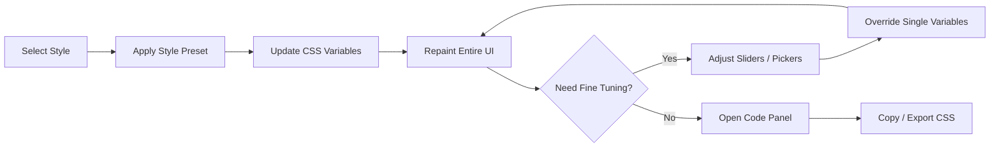

# 🎨 Web Style Visualisation


> 一个面向设计师和前端开发者的交互式风格实验场：选择一种设计风格后，整站 UI 会实时切换，并支持细粒度参数微调与 CSS 导出。

## What & Why

`Web Style Visualisation` 解决一个高频问题：

- 设计风格通常只在截图里展示，无法直观看到“整站一致性”的真实效果。
- 学习者知道概念（如 `Flat Design`、`Glassmorphism`），但难以快速理解它们在真实组件中的差异。
- 团队讨论风格方案时，常缺少可交互的、可复制参数的演示载体。

本项目的核心价值：

- 用同一套页面骨架演示多种设计风格，确保对比公平。
- 以 `CSS Variables` 为统一抽象层，让“风格切换”和“参数微调”都可解释、可复用、可导出。
- 降低社区贡献门槛，新增风格只需提交一个 JSON 文件。

## 目录

- [核心特性](#核心特性)
- [Quick Start](#quick-start)
- [核心交互模型](#核心交互模型)
- [风格谱系](#风格谱系)
- [微调系统](#微调系统)
- [技术架构](#技术架构)
- [数据模型与自动发现](#数据模型与自动发现)
- [项目结构（目标形态）](#项目结构目标形态)
- [部署方案](#部署方案)
- [Roadmap](#roadmap)
- [贡献](#贡献)
- [License](#license)

## 核心特性

| 模块 | 能力 | 对开发者的价值 |
|---|---|---|
| 风格切换器 | 一键切换 `Flat / Glass / Neu / Brutal / Dark` 等风格 | 快速横向对比视觉语言 |
| 全站实时渲染 | `Navbar`、`Hero`、`Card`、`Form`、`Stats` 同步更新 | 验证风格在多组件下的一致性 |
| 微调面板 | 调整颜色、圆角、阴影、字体、间距等参数 | 做“渐进式风格探索”，不是二选一 |
| 代码面板 | 实时展示当前变量集并支持复制/导出 | 直接落地到业务项目 |
| JSON 风格扩展 | 新增风格文件后自动加载 | 降低开源贡献成本 |

## Quick Start

当前仓库为 `docs-first` 阶段（目前仅包含文档）。以下命令用于后续代码初始化后的标准开发流程：

```bash
git clone <repo-url>
cd web-style-visualisation
npm install
npm run dev
```

常用命令：

```bash
npm run build
npm run preview
npm run validate
```

## 核心交互模型

### Interaction Snapshot (ASCII)

```text
┌───────────────────────────────────────────────────────────────────────┐
│  Web Style Visualisation                          [Style ▼] [Code]   │
├───────────────────────────────────────────────────────────────────────┤
│  Style Selector: [Flat] [Glass] [Neu] [Brutal] [Dark] [More ▼]      │
│                                                                       │
│  Live Preview Area                                                    │
│  ┌─────────────────────────────────────────────────────────────────┐  │
│  │ Hero / Cards / Form / Stats all update in real time           │  │
│  └─────────────────────────────────────────────────────────────────┘  │
│                                                                       │
│  Tuning Panel                                                         │
│  ┌─────────────────────────────────────────────────────────────────┐  │
│  │ Color • Radius • Shadow • Font • Special Effects              │  │
│  └─────────────────────────────────────────────────────────────────┘  │
│                                                                       │
│  Code Panel                                                           │
│  ┌─────────────────────────────────────────────────────────────────┐  │
│  │ :root { --color-primary: ...; --border-radius: ...; ... }     │  │
│  └─────────────────────────────────────────────────────────────────┘  │
└───────────────────────────────────────────────────────────────────────┘
```

### Interaction Flow



## 风格谱系

### 经典基础风格

| 风格 | 关键特征 | 核心变量 |
|---|---|---|
| `Flat Design` | 极简、无阴影、`2D`、大色块 | `--shadow: none`, `--radius: 0` |
| `Flat Design 2.0` | Flat + 轻阴影 + 轻渐变 | `--shadow-soft`, `--gradient-soft` |
| `Material Design` | 纸片层级、可读的深度系统 | `--elevation-*`, `--radius: 8px` |
| `Skeuomorphism` | 拟物材质、纹理和内阴影 | `--shadow-inset`, `--gradient-rich` |

### 现代流行风格

| 风格 | 关键特征 | 核心变量 |
|---|---|---|
| `Glassmorphism` | 半透明 + 背景模糊 | `--backdrop-blur`, `--bg-opacity` |
| `Neumorphism` | 同色系凸起/凹陷 | `--shadow-light`, `--shadow-dark` |
| `Claymorphism` | 圆润体块 + 软 3D 感 | `--radius: 24px`, `--shadow-dual` |
| `Brutalism` | 粗边框、硬阴影、强对比 | `--border-width: 3px`, `--font: monospace` |

### 主题与氛围

| 风格 | 关键特征 | 核心变量 |
|---|---|---|
| `Dark Mode` | 深色背景、低炫光、聚焦内容 | `--bg: #1e1e2e`, `--contrast` |
| `Retro / Pixel` | 像素感、霓虹色、低分辨率语义 | `--font-pixel`, `--glow-intensity` |
| `Futuristic / Sci-Fi` | HUD 语言、扫描动画、发光边框 | `--glow-color`, `--scan-speed` |

## 微调系统

所有风格共享同一套“通用参数”；选中某些风格后，再追加“专属参数”。

### 通用参数

| 分类 | 控件 | CSS Variable | 范围 |
|---|---|---|---|
| 颜色 | Color Picker | `--color-primary` | Any |
| 颜色 | Color Picker | `--color-bg` | Any |
| 颜色 | Color Picker | `--color-text` | Any |
| 圆角 | Slider | `--border-radius` | `0 ~ 32px` |
| 阴影 | Slider | `--shadow-x` / `--shadow-y` | `-20 ~ 20px` |
| 阴影 | Slider | `--shadow-blur` | `0 ~ 40px` |
| 字体 | Select | `--font-family` | Preset list |
| 字重 | Slider | `--font-weight` | `100 ~ 900` |
| 间距 | Slider | `--spacing` | `4 ~ 32px` |
| 边框 | Slider | `--border-width` | `0 ~ 6px` |

### 专属参数（按风格出现）

| 风格 | 参数 | CSS Variable | 说明 |
|---|---|---|---|
| `Glassmorphism` | 模糊强度 | `--backdrop-blur` | 毛玻璃核心参数 |
| `Glassmorphism` | 透明度 | `--bg-opacity` | 控制面板/卡片透光 |
| `Neumorphism` | 凸起/凹陷 | `--neu-type` | `raised` / `pressed` |
| `Brutalism` | 偏移量 | `--brutal-offset` | 硬阴影偏移 |
| `Material Design` | 层级 | `--elevation` | 对应 Material 深度 |
| `Futuristic / Sci-Fi` | 扫描速度 | `--animation-speed` | HUD 动画节奏 |

## 技术架构

### 栈选型

| 层面 | 技术 | 选择理由 |
|---|---|---|
| 构建 | `Vite` | 启动快，HMR 快，配置轻 |
| 逻辑 | `Vanilla JS` | 无框架心智负担，便于教学与扩展 |
| 样式 | `Vanilla CSS` + `CSS Variables` | 变量驱动，风格切换成本低 |
| 代码高亮 | `Prism.js` | 轻量可控 |
| 部署 | `GitHub Pages` + `GitHub Actions` | 低门槛自动化发布 |

### 核心模式：变量驱动

```css
:root {
  --color-primary: #3498db;
  --color-bg: #ffffff;
  --color-surface: #f5f5f5;
  --color-text: #333333;

  --border-radius: 8px;

  --shadow-x: 0px;
  --shadow-y: 2px;
  --shadow-blur: 8px;
  --shadow-color: rgba(0, 0, 0, 0.1);

  --font-family: "Inter", sans-serif;
  --font-weight: 400;
  --font-size-base: 16px;

  --spacing: 16px;
  --border-width: 1px;
  --border-color: #e0e0e0;

  --backdrop-blur: 0px;
  --bg-opacity: 1;
  --glow-intensity: 0;

  --transition-speed: 0.3s;
}
```

```javascript
function applyStyle(styleId) {
  const style = STYLES[styleId];
  const root = document.documentElement;

  Object.entries(style.variables).forEach(([key, value]) => {
    root.style.setProperty(key, value);
  });

  updateTuningPanel(style);
  updateCodePanel(style);
}

function onTuningChange(variableName, value) {
  document.documentElement.style.setProperty(variableName, value);
  updateCodePanel();
}
```

## 数据模型与自动发现

### 风格 JSON 示例

```json
{
  "id": "glassmorphism",
  "name": "Glassmorphism",
  "nameZh": "毛玻璃",
  "category": "modern",
  "description": "Frosted glass effect with blur and transparency",
  "descriptionZh": "通过模糊和半透明效果创造磨砂玻璃质感",
  "author": "your-github-username",
  "references": ["https://css.glass/"],
  "variables": {
    "--color-primary": "#6366f1",
    "--color-bg": "#0f0f23",
    "--color-surface": "rgba(255, 255, 255, 0.1)",
    "--color-text": "#ffffff",
    "--border-radius": "16px",
    "--shadow-blur": "32px",
    "--shadow-color": "rgba(31, 38, 135, 0.15)",
    "--backdrop-blur": "10px",
    "--bg-opacity": "0.1",
    "--border-width": "1px",
    "--border-color": "rgba(255, 255, 255, 0.2)"
  },
  "specialTuning": [
    {
      "variable": "--backdrop-blur",
      "label": "模糊强度",
      "type": "range",
      "min": 0,
      "max": 30,
      "unit": "px"
    }
  ],
  "keyProperties": [
    { "property": "backdrop-filter", "explanation": "核心：模糊背景内容" },
    { "property": "background: rgba()", "explanation": "半透明增强玻璃感" }
  ]
}
```

### 自动发现机制

```javascript
const styleModules = import.meta.glob("./*.json", { eager: true });

export const STYLES = Object.fromEntries(
  Object.entries(styleModules)
    .filter(([path]) => !path.includes("_"))
    .map(([, mod]) => [mod.default.id, mod.default])
);
```

## 项目结构（目标形态）

说明：下列结构是代码初始化后的目标目录。当前仓库暂为文档阶段。

```text
web-style-visualisation/
├── index.html
├── package.json
├── vite.config.js
├── README.md
├── CONTRIBUTING.md
├── src/
│   ├── main.js
│   ├── style.css
│   ├── styles/
│   │   ├── _template.json
│   │   ├── _schema.json
│   │   ├── index.js
│   │   └── *.json
│   ├── components/
│   │   ├── navbar.js
│   │   ├── hero.js
│   │   ├── cards.js
│   │   ├── form.js
│   │   ├── buttons.js
│   │   └── stats.js
│   ├── panels/
│   │   ├── style-selector.js
│   │   ├── tuning-panel.js
│   │   └── code-panel.js
│   └── utils/
│       ├── css-var-manager.js
│       └── export.js
├── scripts/
│   └── validate-styles.js
├── public/
│   └── fonts/
└── .github/
    └── workflows/
        ├── deploy.yml
        └── validate-pr.yml
```

## 部署方案

### GitHub Actions 工作流

```yaml
name: Deploy to GitHub Pages

on:
  push:
    branches: [main]

jobs:
  deploy:
    runs-on: ubuntu-latest
    permissions:
      pages: write
      id-token: write
    steps:
      - uses: actions/checkout@v4
      - uses: actions/setup-node@v4
        with:
          node-version: 20
      - run: npm ci
      - run: npm run build
      - uses: actions/upload-pages-artifact@v3
        with:
          path: dist
      - uses: actions/deploy-pages@v4
```

### Vite 基础配置

```javascript
export default {
  base: "/web-style-visualisation/",
  build: {
    outDir: "dist"
  }
};
```

## Roadmap

### Phase 1 (MVP)

- [ ] 初始化 Vite 项目与 GitHub Pages 部署
- [ ] 完成 `CSS Variables` 驱动架构
- [ ] 完成风格选择器、微调面板、代码面板
- [ ] 内置至少 8 种风格 JSON

### Phase 2 (体验增强)

- [ ] 双栏对比模式
- [ ] 变量差异高亮（Diff）
- [ ] URL 参数分享
- [ ] 移动端适配

### Phase 3 (高级能力)

- [ ] 风格混搭实验
- [ ] 自定义风格保存（`localStorage`）
- [ ] 时间线演进视图
- [ ] 更多组件：Table / Modal / Sidebar / Dashboard

## 贡献

- 文档贡献：欢迎直接提交 `README` / `CONTRIBUTING` 改进。
- 风格贡献：请参考 [CONTRIBUTING.md](./CONTRIBUTING.md) 的 JSON 规范。
- Issue 讨论：如需新增风格类别或变量协议，建议先开 Issue 对齐方案。

## License

本项目采用 [MIT License](./LICENSE)。
